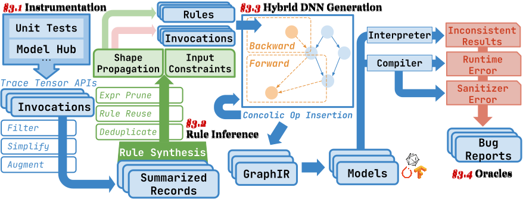

# NeuRI: Diversifying DNN Generation via Inductive Rule Inference

<p align="center">
    <a href="https://arxiv.org/abs/2302.02261">
    <a href="https://github.com/ise-uiuc/neuri-artifact/blob/main/LICENSE"></a>
    <a href="https://hub.docker.com/r/ganler/neuri-fse23-ae/tags"></a>
</p>

Welcome to the artifact repository of the NeuRI paper which is accepted by ESEC/FSE 2023.


## Bug finding evidence (RQ3)

See [links to real-world bug reports](docs/rq3-bug-reports.md).


## Get ready for running experiments!

> [!IMPORTANT]
>
> **General test-bed requirements**
> - **OS**: A Linux System with Docker Support;
> - **Hardware**: X86/X64 CPU; 16GB RAM; 1TB Storage; Good Network to GitHub and Docker Hub;

> **Note**
>
> Before you start, please make sure you have [Docker](https://docs.docker.com/engine/install/) installed.
>
> To check the installation:
> ```bash
> docker --version # Test docker availability
> # Docker version 20.10.12, build e91ed5707e
> ```

```bash
docker pull ganler/neuri-fse23-ae:latest

# Run docker image
docker run -it --name ${USER}-neuri ganler/neuri-fse23-ae
# Now, you will "get into" the image like entering a virtual machine.
# By using this command, you will "get into" the image like entering a virtual machine.
# The session will be kept under the name "${USER}-neuri"

# Inside the image;
cd /artifact
git remote set-url origin https://github.com/ise-uiuc/neuri-artifact.git
git pull origin main
```

## Evaluating Coverage (RQ1)

The overall process of NeuRI is shown as:



> **Note**
> **Pre-generated rules**: For simplicity, we pre-generated the output of instrumentation and rule inference in `./data` directory.
> To perform instrumentation from scratch, follow [instructions here](https://github.com/ise-uiuc/neuri-artifact/blob/main/neuri/autoinf/instrument/README.md).
> To perform rule inference, follow the RQ2 section.

### S1: Start fuzzing and cache test-cases

We will use `./fuzz.sh` to generate the test-cases.

> [!NOTE]
>
> **Command usage of**: `./fuzz.sh NSIZE METHOD MODEL BACKEND TIME`
>
> **Arguments**:
> - `NSIZE`: the number of operators in each generated graph.
> - `METHOD`: in `["neuri", "neuri-i", "neuri-r", "symbolic-cinit"]`.
> - `MODEL`: in `["tensorflow", "torch"]`.
> - `BACKEND`: in `["xla", "torchjit"]`.
> - `TIME`: fuzzing time in formats like `4h`, `1m`, `30s`.
>
> **Outputs**:
> - `$(pwd)/gen/${MODEL}-${METHOD}-n${NSIZE}.models`: the generated test-cases (models)

#### For PyTorch

> [!NOTE]
>
> You may parallelize the scripts below if you have multiple cores, at the risk of potential result unstability.
> Nonetheless the results in the paper are generated without script parallelization.

```bash
source ./env_std.sh
./fuzz.sh 5 neuri          torch torchjit 4h
./fuzz.sh 5 neuri-i        torch torchjit 4h
./fuzz.sh 5 neuri-r        torch torchjit 4h
./fuzz.sh 5 symbolic-cinit torch torchjit 4h # NNSmith
./fuzz.sh 1  neuri         torch torchjit 4h
./fuzz.sh 9  neuri         torch torchjit 4h
./fuzz.sh 13 neuri         torch torchjit 4h
```

#### For TensorFlow

```bash
source ./env_std.sh
./fuzz.sh 5 neuri          tensorflow xla 4h
./fuzz.sh 5 neuri-i        tensorflow xla 4h
./fuzz.sh 5 neuri-r        tensorflow xla 4h
./fuzz.sh 5 symbolic-cinit tensorflow xla 4h # NNSmith
```

### S2: Collect coverage

#### For PyTorch

```bash
source ./env_cov.sh
python experiments/evaluate_models.py  --root $(pwd)/gen/torch-neuri-n5.models          --model_type torch --backend_type torchjit --parallel $(nproc)
python experiments/evaluate_models.py  --root $(pwd)/gen/torch-neuri-i-n5.models        --model_type torch --backend_type torchjit --parallel $(nproc)
python experiments/evaluate_models.py  --root $(pwd)/gen/torch-neuri-r-n5.models        --model_type torch --backend_type torchjit --parallel $(nproc)
python experiments/evaluate_models.py  --root $(pwd)/gen/torch-symbolic-cinit-n5.models --model_type torch --backend_type torchjit --parallel $(nproc)
python experiments/evaluate_models.py  --root $(pwd)/gen/torch-neuri-n1.models          --model_type torch --backend_type torchjit --parallel $(nproc)
python experiments/evaluate_models.py  --root $(pwd)/gen/torch-neuri-n9.models          --model_type torch --backend_type torchjit --parallel $(nproc)
python experiments/evaluate_models.py  --root $(pwd)/gen/torch-neuri-n13.models         --model_type torch --backend_type torchjit --parallel $(nproc)
# Compute coverage
python experiments/process_profraws.py --root $(pwd)/gen/torch-neuri-n5.models    \
                                       --llvm-config-path $(which llvm-config-14) \
                                       --instrumented-libs "$(pwd)/build/pytorch-cov/build/lib/libtorch_cpu.so" "$(pwd)/build/pytorch-cov/build/lib/libtorch.so" \
                                        --batch-size 1000 --parallel $(nproc)
python experiments/process_profraws.py --root $(pwd)/gen/torch-neuri-i-n5.models  \
                                       --llvm-config-path $(which llvm-config-14) \
                                       --instrumented-libs "$(pwd)/build/pytorch-cov/build/lib/libtorch_cpu.so" "$(pwd)/build/pytorch-cov/build/lib/libtorch.so" \
                                        --batch-size 1000 --parallel $(nproc)
python experiments/process_profraws.py --root $(pwd)/gen/torch-neuri-r-n5.models  \
                                       --llvm-config-path $(which llvm-config-14) \
                                       --instrumented-libs "$(pwd)/build/pytorch-cov/build/lib/libtorch_cpu.so" "$(pwd)/build/pytorch-cov/build/lib/libtorch.so" \
                                        --batch-size 1000 --parallel $(nproc)
python experiments/process_profraws.py --root $(pwd)/gen/torch-symbolic-cinit-n5.models \
                                       --llvm-config-path $(which llvm-config-14)       \
                                       --instrumented-libs "$(pwd)/build/pytorch-cov/build/lib/libtorch_cpu.so" "$(pwd)/build/pytorch-cov/build/lib/libtorch.so" \
                                        --batch-size 1000 --parallel $(nproc)
python experiments/process_profraws.py --root $(pwd)/gen/torch-neuri-n1.models    \
                                       --llvm-config-path $(which llvm-config-14) \
                                       --instrumented-libs "$(pwd)/build/pytorch-cov/build/lib/libtorch_cpu.so" "$(pwd)/build/pytorch-cov/build/lib/libtorch.so" \
                                        --batch-size 1000 --parallel $(nproc)
python experiments/process_profraws.py --root $(pwd)/gen/torch-neuri-n9.models    \
                                       --llvm-config-path $(which llvm-config-14) \
                                       --instrumented-libs "$(pwd)/build/pytorch-cov/build/lib/libtorch_cpu.so" "$(pwd)/build/pytorch-cov/build/lib/libtorch.so" \
                                        --batch-size 1000 --parallel $(nproc)
python experiments/process_profraws.py --root $(pwd)/gen/torch-neuri-n13.models   \
                                       --llvm-config-path $(which llvm-config-14) \
                                       --instrumented-libs "$(pwd)/build/pytorch-cov/build/lib/libtorch_cpu.so" "$(pwd)/build/pytorch-cov/build/lib/libtorch.so" \
                                        --batch-size 1000 --parallel $(nproc)
```

#### For TensorFlow

```bash
source ./env_cov.sh
python3 experiments/evaluate_tf_models.py --root $(pwd)/gen/tensorflow-neuri-n5.models --parallel $(nproc)
python3 experiments/evaluate_tf_models.py --root $(pwd)/gen/tensorflow-neuri-i-n5.models --parallel $(nproc)
python3 experiments/evaluate_tf_models.py --root $(pwd)/gen/tensorflow-neuri-r-n5.models --parallel $(nproc)
python3 experiments/evaluate_tf_models.py --root $(pwd)/gen/tensorflow-symbolic-cinit-n5.models --parallel $(nproc)
# Compute coverage
python3 experiments/process_lcov.py --root $(pwd)/gen/tensorflow-neuri-n5.models --parallel $(nproc)
python3 experiments/process_lcov.py --root $(pwd)/gen/tensorflow-neuri-i-n5.models --parallel $(nproc)
python3 experiments/process_lcov.py --root $(pwd)/gen/tensorflow-neuri-r-n5.models --parallel $(nproc)
python3 experiments/process_lcov.py --root $(pwd)/gen/tensorflow-symbolic-cinit-n5.models --parallel $(nproc)
```

### S3: Checkout the results

#### Table 1 & 2

```bash
# PyTorch
python experiments/genstat.py --root $(pwd)/gen/torch-neuri-n5
python experiments/genstat.py --root $(pwd)/gen/torch-neuri-i-n5
python experiments/genstat.py --root $(pwd)/gen/torch-neuri-r-n5
python experiments/genstat.py --root $(pwd)/gen/torch-symbolic-cinit-n5

# TensorFlow
python experiments/genstat.py --root $(pwd)/gen/tensorflow-neuri-n5
python experiments/genstat.py --root $(pwd)/gen/tensorflow-neuri-i-n5
python experiments/genstat.py --root $(pwd)/gen/tensorflow-neuri-r-n5
python experiments/genstat.py --root $(pwd)/gen/tensorflow-symbolic-cinit-n5
```

Check the terminal output for the results.

#### Figure 6 (a)

```bash
python experiments/viz_merged_cov.py --folders             \
        $(pwd)/gen/torch-symbolic-cinit-n5.models/coverage \
        $(pwd)/gen/torch-neuri-r-n5.models/coverage        \
        $(pwd)/gen/torch-neuri-i-n5.models/coverage        \
        $(pwd)/gen/torch-neuri-n5.models/coverage          \
    --tags '\textsc{NNSmith}' '\textsc{NeuRI}$^r$' '\textsc{NeuRI}$^i$'  '\textsc{NeuRI}'
```

Check images under `./results/branch_cov-time.png` for the results.

#### Figure 6 (b)

```bash
python experiments/viz_merged_cov.py --folders                  \
        $(pwd)/gen/tensorflow-symbolic-cinit-n5.models/coverage \
        $(pwd)/gen/tensorflow-neuri-r-n5.models/coverage        \
        $(pwd)/gen/tensorflow-neuri-i-n5.models/coverage        \
        $(pwd)/gen/tensorflow-neuri-n5.models/coverage          \
    --tags '\textsc{NNSmith}' '\textsc{NeuRI}$^r$' '\textsc{NeuRI}$^i$'  '\textsc{NeuRI}'
```

Check images under `./results/branch_cov-time.png` for the results.

#### Figure 6 (c)

```bash
python experiments/viz_merged_cov.py --folders             \
        $(pwd)/gen/torch-neuri-n1.models/coverage          \
        $(pwd)/gen/torch-neuri-n5.models/coverage          \
        $(pwd)/gen/torch-neuri-n9.models/coverage          \
        $(pwd)/gen/torch-neuri-n13.models/coverage         \
    --tags '\#Node 1' '\#Node 5' '\#Node 9' '\#Node 13'
```

Check images under `./results/branch_cov-time.png` for the results.

## Evaluating Rule Inference (RQ2)

### S1: Tree & rule generation

```bash
source ./env_std.sh
python3 neuri/autoinf/inference/tree.py
python3 neuri/autoinf/inference/augmentation.py
python3 neuri/autoinf/inference/shape_solve.py
python3 neuri/autoinf/inference/predicate_solve.py
python3 neuri/autoinf/inference/nnsmith_reuse.py
python3 neuri/autoinf/inference/rule_validity.py
python3 neuri/autoinf/inference/rosette_solve.py
```

Rules will be stored in `gen/`.

### S2: 1-Node test-cases generation

```bash
RULE_DIR=$(pwd)/gen ./fuzz.sh 1 neuri-i   torch      torchjit 4h
RULE_DIR=$(pwd)/gen ./fuzz.sh 1 neuri-i   tensorflow xla      4h
```

### S3: Check the results

#### Table 3 & 4

```bash
python3 table3.py
python3 table4.py
```

Check the terminal output for the results.

## Learning More

- Pre-print: [](https://arxiv.org/abs/2302.02261)
- NeuRI is being merged into [NNSmith](https://github.com/ise-uiuc/nnsmith)
